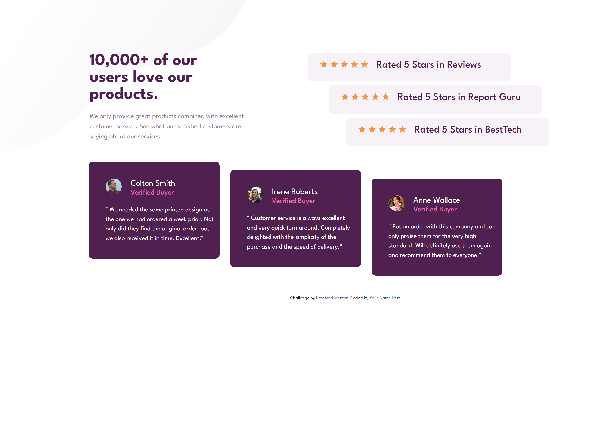

# Frontend Mentor - Social proof section solution

This is a solution to the [Social proof section challenge on Frontend Mentor](https://www.frontendmentor.io/challenges/social-proof-section-6e0qTv_bA). Frontend Mentor challenges help you improve your coding skills by building realistic projects. 

## Table of contents

  - [Screenshot](#screenshot)
  - [Links](#links)
  - [Built with](#built-with)
  - [Author](#author)

### Screenshot

### Links

- Solution URL: [Add solution URL here](https://github.com/Raghda19/Social-proof-section.git)
- Live Site URL:(https://raghda19.github.io/Social-proof-section/)

### Built with

- Semantic HTML5 markup
- CSS custom properties
- Flexbox
- CSS Grid
- [Bootstrap]( https://getbootstrap.com/docs/5.3/getting-started/introduction/) 

## Author

- Website - [Raghda Mohamed](https://raghda19.github.io/Social-proof-section/)
- Frontend Mentor - [@Raghda19](https://www.frontendmentor.io/profile/Raghda19)

